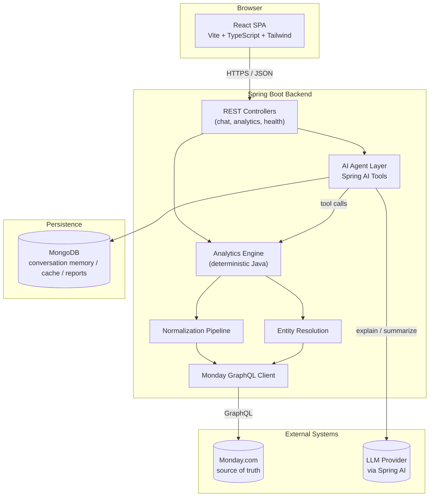

# Skylark AI Business Intelligence Agent

A conversational business-intelligence platform for founders and executives to ask
natural-language questions about deal pipeline, revenue, execution, and billing
data — backed by Monday.com as the single source of business truth, with an AI
agent that explains and narrates insights it never computes itself.

## Overview

The core design principle running through the whole system: **the LLM explains,
Java calculates.** Every number a user sees — pipeline value, forecast, win rate,
receivables — is computed deterministically in Java from data fetched live from
Monday.com. The AI layer's job is intent understanding, tool selection, and
narrating results conversationally (including surfacing data-quality caveats) —
never arithmetic. This makes the numbers auditable and reproducible, and makes the
system's behavior independent of any particular model's reliability at math.

## Architecture



Two request paths exist side by side:

- **Conversational path** (`POST /api/chat`) — the user's message goes to the LLM
  with the full tool catalog registered. The model picks a tool, Java executes it
  deterministically against live Monday.com data, and the model narrates the
  result. No arithmetic ever happens inside the model.
- **Direct path** (`GET /api/analytics/*`) — the dashboard and analytics pages call
  these endpoints directly, bypassing the LLM entirely. This keeps the default UI
  fast, free, and independent of LLM provider availability.

MongoDB is **not** the business database — Monday.com is the only source of
business data. Mongo exists solely for conversation memory, analytics caching, and
generated reports (some of this is scaffolded for future use, not all wired up yet
— see **Current Status** below).

## Tech Stack

### Backend

| Layer | Technology |
|---|---|
| Language / runtime | Java 21 |
| Framework | Spring Boot 4, Spring Web, Spring Validation |
| AI orchestration | Spring AI (`ChatClient`, `@Tool` function calling) |
| Business data source | Monday.com GraphQL API v2 (custom typed client) |
| Persistence (non-business) | MongoDB (Spring Data MongoDB) |
| API docs | springdoc-openapi (Swagger UI) |
| Build | Maven (wrapper included, no local install needed) |
| Testing | JUnit 5, Mockito, AssertJ, WireMock, Spring `@WebMvcTest` |

### Frontend

| Layer | Technology |
|---|---|
| Framework | React 19 + TypeScript |
| Build tool | Vite |
| Styling | Tailwind CSS v4 |
| Data fetching | TanStack Query |
| Routing | React Router |
| Charts | Recharts |
| Testing | Vitest + React Testing Library |

## Project Structure

```
skylark-bi-agent-backend/
  src/main/java/com/skylark/skylarkbiagentbackend/
    client/monday/     # Reusable Monday.com GraphQL client (pagination, retry, rate limiting)
    normalizer/         # Raw Monday data -> clean domain objects (handles blanks, casing, bad dates, etc.)
    resolution/          # Cross-board entity matching (client codes don't align 1:1 across boards)
    analytics/           # Deterministic business calculations — one service per capability
    agent/
      router/            # Natural-language date phrase resolution ("this quarter" -> concrete dates)
      tool/               # Thin @Tool wrappers exposing analytics services to the AI agent
    controller/           # REST endpoints
    config/                # Environment-driven configuration for every integration
    exception/              # Centralized error handling, one consistent error response shape
    dto/                      # Shared request/response shapes


  src/
    pages/          # Dashboard, AI Chat, Pipeline & Forecast, Revenue, Execution, Billing & Collections
    components/      # Shared UI (cards, loading/error states, layout shell)
    lib/               # Typed API client + TypeScript types mirroring the backend's DTOs
```

## How It Works

1. **Normalization**: raw Monday.com board items are fetched via a typed GraphQL
   client and passed through a normalizer that handles real-world data problems —
   blank fields, inconsistent casing, malformed numbers, stray header rows —
   without ever fabricating a value. Anything that can't be parsed is excluded from
   calculations and reported as a caveat, never silently dropped or defaulted to
   zero.
2. **Entity resolution**: the Deal Tracker and Work Order Tracker boards use
   different client-code namespaces, so cross-board rollups go through a matching
   pipeline (exact normalized-code match first, fuzzy name matching as a fallback)
   with an explicit confidence level on every match — never a naive join.
3. **Analytics**: each business capability (pipeline, forecast, revenue, execution,
   billing, collections) is its own service doing pure, deterministic Java
   calculations over normalized data. These are unit-tested against hand-computed
   fixtures independent of any AI behavior.
4. **Agent layer**: each analytics service has a thin `@Tool`-annotated wrapper the
   LLM can call. The model's system prompt enforces that every number in its answer
   must come verbatim from a tool result, and that data-quality warnings attached to
   a tool result must be surfaced, never omitted.
5. **Presentation**: the React frontend is a pure presentation layer — it renders
   whatever the backend returns and contains no business logic of its own.

## Business Analytics Capabilities

| Capability | What it answers |
|---|---|
| Pipeline | Total/weighted pipeline value, stage funnel, win rate, average deal size, deal aging |
| Forecast | Probability-weighted revenue forecast for a horizon, with best/worst case |
| Revenue | Booked revenue (value of Won deals) |
| Execution | Work order status distribution, delayed/overdue work orders, delivery variance |
| Billing | Billing/invoice status breakdown, total amount still to be billed |
| Collections | Total collected, total outstanding receivable, aged receivables |

Every response includes a `warnings` array describing exactly what data was
excluded from the calculation and why (e.g. "12 deals excluded: missing revenue
value") — the UI and the AI agent both surface these rather than presenting a
number as more complete than it is.

## REST API Reference

| Method | Path | Purpose |
|---|---|---|
| POST | `/api/chat` | Conversational endpoint — natural-language questions, AI-mediated |
| GET | `/api/analytics/pipeline` | Pipeline snapshot |
| GET | `/api/analytics/forecast` | Revenue forecast for a horizon |
| GET | `/api/analytics/revenue` | Revenue summary |
| GET | `/api/analytics/execution` | Execution status snapshot |
| GET | `/api/analytics/billing` | Billing status snapshot |
| GET | `/api/analytics/collections` | Collections snapshot |
| GET | `/api/health` | Deployment readiness check |

All analytics endpoints accept optional query filters: `sector`, `owner`, `client`,
`status`, `dateFrom`, `dateTo`. Full interactive documentation is available at
`/swagger-ui.html` when the backend is running.

## Running Locally

**Backend:**
```bash
cd skylark-bi-agent-backend
./mvnw spring-boot:run
```
Runs on `http://localhost:8080`.

**Frontend:**
```bash
npm install
npm run dev
```
Runs on `http://localhost:5173` and proxies API calls to the backend automatically.

## Testing

**Backend** (114 tests — unit tests for every normalizer/analytics edge case,
WireMock-based integration tests proving the full fetch-normalize-calculate chain,
and controller-level tests):
```bash
cd skylark-bi-agent-backend
./mvnw clean test
```

**Frontend:**
```bash
cd skylark-bi-agent
npm test
```

## Deployment

Both services have multi-stage Dockerfiles (JDK build → slim JRE runtime for the
backend; Node build → nginx static serving for the frontend, which also reverse-
proxies `/api` to the backend container). A `docker-compose.yml` at the repository
root orchestrates the backend, frontend, and a MongoDB container together with
health checks for all three.

```bash
docker compose up -d --build
```

## Current Status & Known Gaps

Being transparent about what's built versus what the original design anticipated:

- **Built and working**: pipeline, forecast, revenue (booked side), execution,
  billing, and collections analytics, all reachable via both the chat agent and
  direct REST endpoints; entity resolution engine; the full normalization pipeline
  for both boards.
- **Not yet built**: per-owner/client/sector rollups, a composite risk-analysis
  view, and an executive report generator were scoped in the original design but
  not implemented. Billed/collected revenue (as opposed to booked revenue) isn't
  wired into the revenue summary yet, since that requires the billing/collections
  data to be joined in — the field exists in the response shape and is `null` with
  an explanatory note rather than a fabricated number.
- **No tool exists yet for listing individual deals/work orders** by name — only
  aggregate analytics. Asking the chat agent to "list 10 deals" will correctly say
  it can't, rather than inventing an answer.
- **Conversation memory isn't persisted** — each chat request is handled as a
  single turn; multi-turn context ("now only show me Mining" as a follow-up) isn't
  wired up yet, though the Mongo collection design for it exists.
